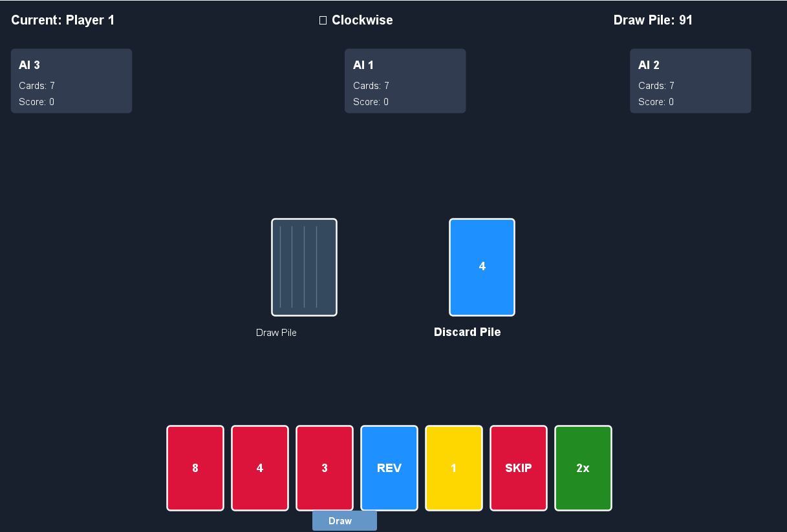
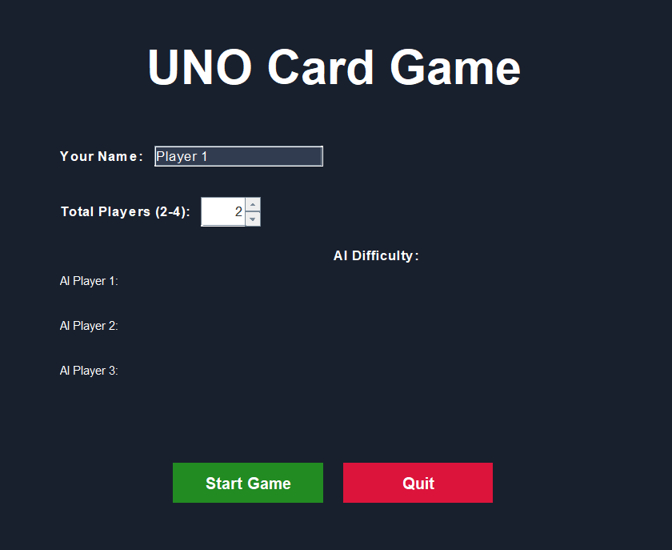
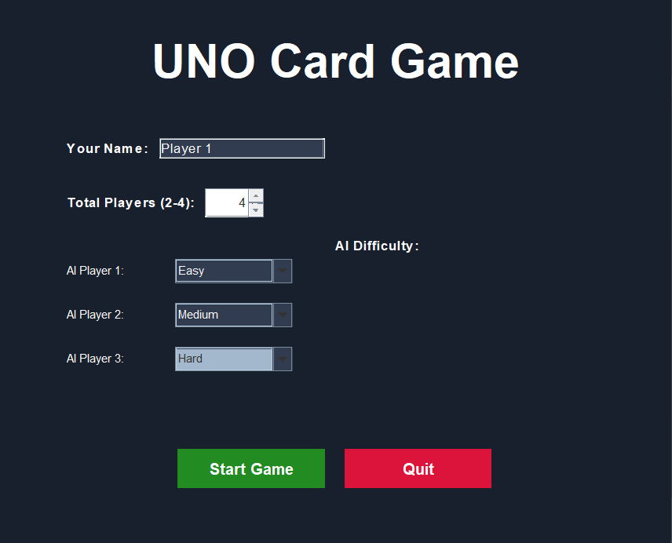
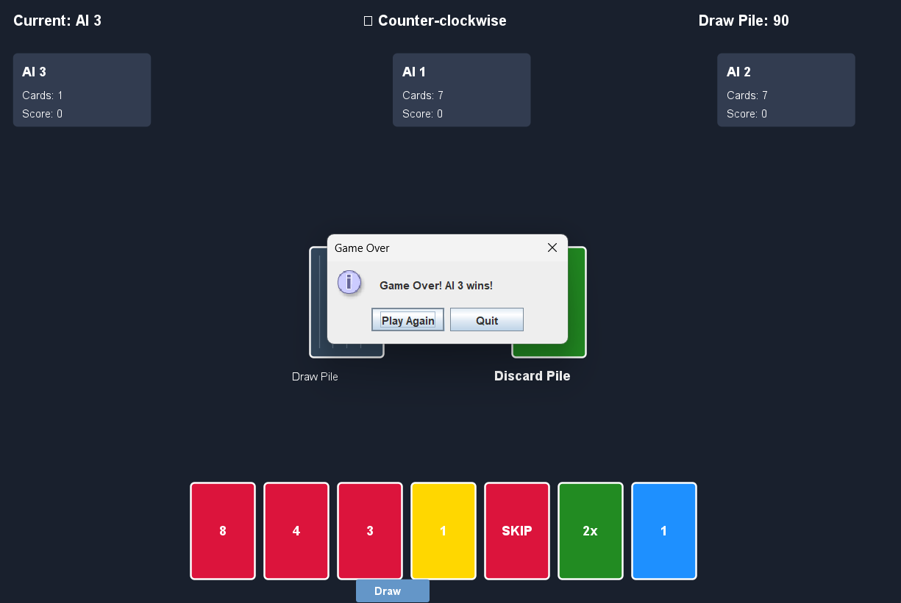

# UNO Card Game

## Overview

A group project implementing the UNO card game with a graphical user interface.

  
  
  

## My Contributions

- Assisted in implementing game logic
- Contributed to classes Player, AIPlayer, GameEngine.
- Participated in debugging
- Worked on testing and collaboration

## Technologies

- Java
- Swing

## Future Improvements

- Improved UI
- Official Rules
